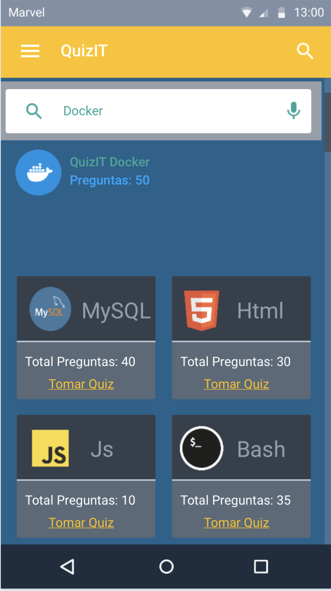

## Diseño de interfaz de usuario

# Interfaz de usuario de QuizIT 

-> Profe disculpe que no supe como disminuir el tamaño de las imagenes

El diseño completo y el prototype esta disponible
en [MarvelApp](https://marvelapp.com/prototype/8337757)

# A continuación se presentan las principales pantallas:

1. Icono de la app en el telefono android

   

2. Login

   El usuario podra hacer login con sus credenciales si ya se registro o podra ingresar con su cuenta de google o de github.

   

3. Register

   desde la pantalla de inicio el usuario puede dar click en el enlace que lo lleva a esta pantalla de registro.

   
   
 4. Pantalla inicio

   Luego de que el usuario hace el login ingresara a esta pantalla de inicio donde puede ver el menu, hacer una busqueda o selecionar entre
   las distintas categorias para hacer un QuizIT

   
   
 5. Busqueda

   Desde la pantalla de inicio el usuario puede dar click en el icono de la lupa, lo que hara que se despliege un input para la busqueda
   del tema que el usuario prefiera.

   
   
 6. menu

   El usuario puede dar click en el icono de menu, donde se mostrara un menu con diferentes opciones para el manejo de la cuenta, puntaje,
   configuracion y otras cosas mas.

      
   
 7. Puntaje

   Desde las opciones del menu el usuario podra dar click en mi puntaje y ver una pantalla que le mostraja su puntaje acumulado y los QuizIT's terminados.

   
   
   
   
   
   
